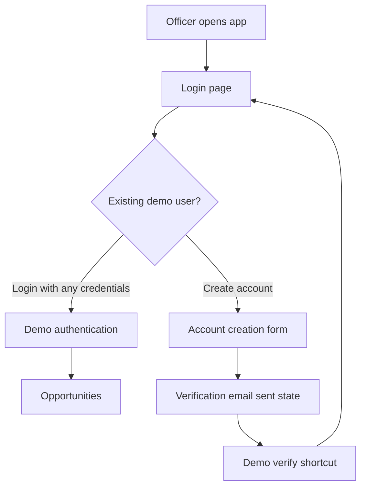
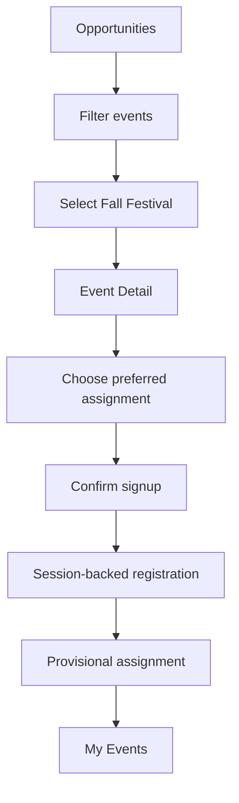
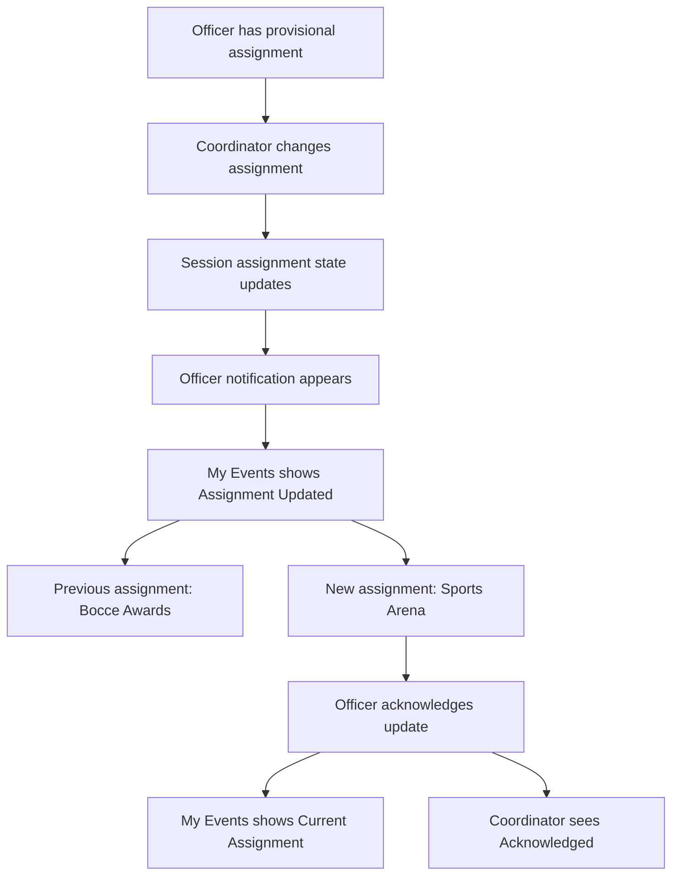
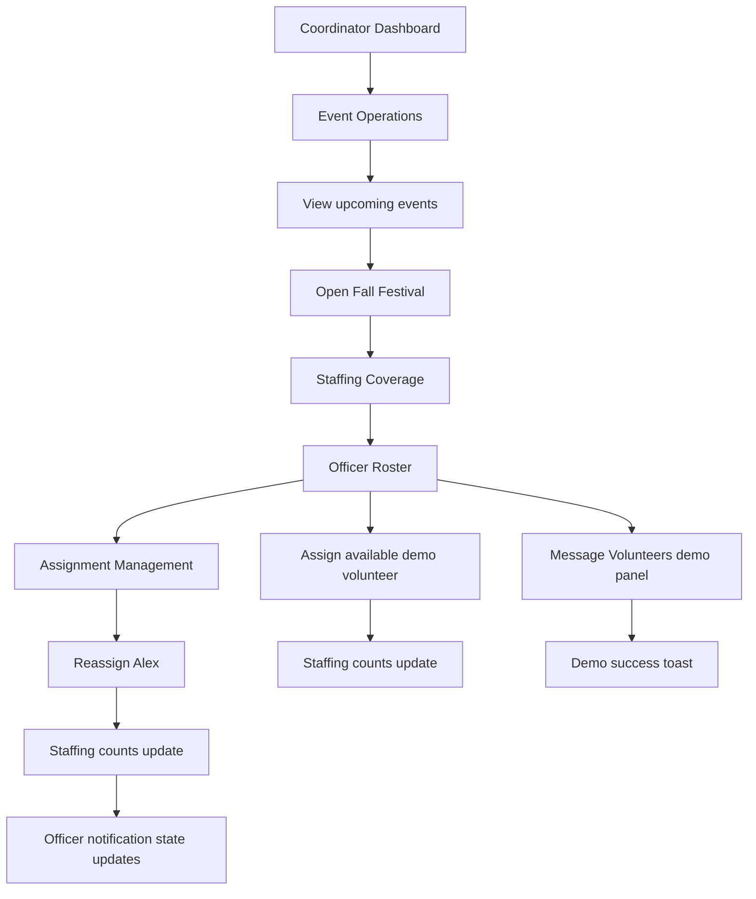
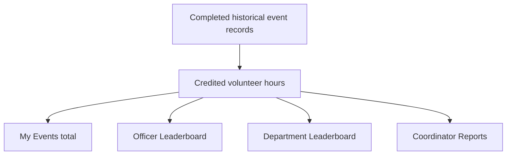
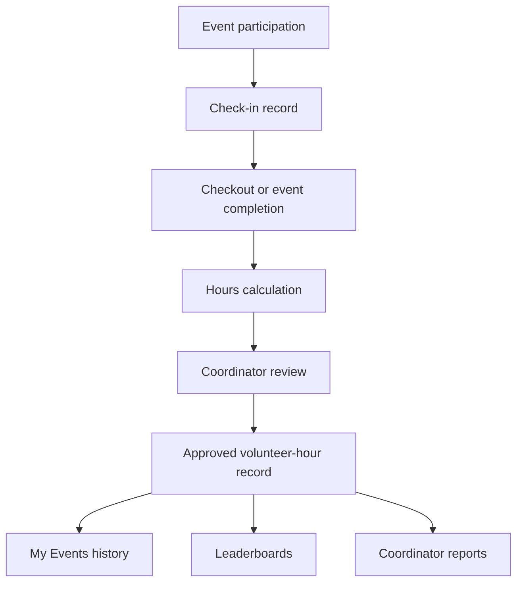
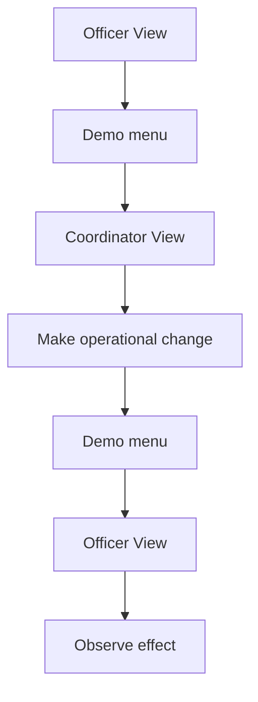
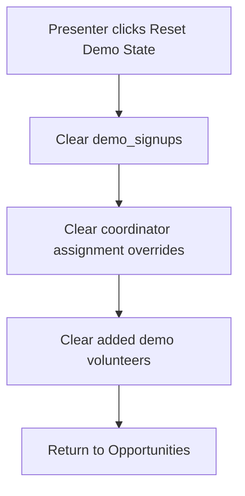
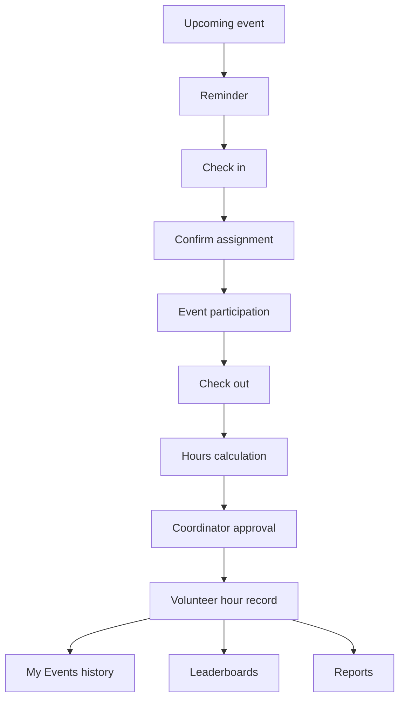

# SODE Volunteer Platform Demo v1 Workflows

This document describes the implemented demo workflows and likely future production flows. It is intended to help a future team create Figma or FigJam workflow charts.

## 1. Officer Account / Entry

### Current Demo Behavior

Notes:

- Login is simulated.
- Account creation stores pending account data in session.
- Verification is simulated through `/demo/verify`.
- No production identity provider exists.

### Future Production Flow

Production needs real identity, agency verification, role assignment, and secure account lifecycle behavior.

## 2. Officer Opportunity Flow

### Current Demo Behavior

Notes:

- The selected preference becomes the provisional assignment in the demo.
- Fall Festival is the full event-detail workflow.
- Bowling Classic is mocked as an already signed-up event.

## 3. Assignment Change Flow

### Current Demo Behavior

Important:

- Acknowledgment means seen.
- Acknowledgment does not mean accepted or approved.
- No real email, SMS, push, or notification backend exists.

## 4. Coordinator Event Operations Flow

### Current Demo Behavior

Fall Festival initial staffing:

| Area | Initial state |
| --- | --- |
| Bocce Awards | 3 / 3, filled |
| Sports Arena | 2 / 4, 2 officers needed |
| Main Awards | 3 / 3, filled |
| LDR Awards | 2 / 2, filled |
| Cafeteria | 2 / 4, 2 officers needed |
| Overall | 12 / 16, 4 officers needed |

After Alex is reassigned from Bocce Awards to Sports Arena:

| Area | Updated state |
| --- | --- |
| Bocce Awards | 2 / 3, 1 officer needed |
| Sports Arena | 3 / 4, 1 officer needed |
| Overall | 12 / 16, 4 officers needed |

The assignment distribution changes. The number of volunteers does not.

## 5. Volunteer Hours Flow

### Current Demo Behavior

Current data behavior:

- Alex Morgan has three completed historical records.
- Hours: 6.5 + 8.0 + 4.0 = 18.5.
- My Events shows 18.5.
- Leaderboard uses 18.5 for Alex.
- Coordinator Reports uses 18.5 for Alex.
- Coordinator report summary metrics are seeded demo figures.

### Future Production Flow

Not implemented:

- Check-in methodology.
- Checkout methodology.
- Hour calculation rules.
- Approval rules.
- No-show and cancellation handling.

These require discovery and product validation.

## 6. Demo Role-Switch Flow

### Current Demo Behavior

Notes:

- Role switching is a presentation mechanism.
- It is not production authorization.
- Session state is preserved while switching.

## 7. Demo Reset Flow

### Current Demo Behavior

Reset restores:

- Fall Festival unsigned/officer clean state.
- Fall Festival coordinator staffing to 12 / 16.
- Bocce Awards to 3 / 3 filled.
- Sports Arena to 2 / 4, 2 officers needed.
- Main Awards to 3 / 3 filled.
- LDR Awards to 2 / 2 filled.
- Cafeteria to 2 / 4, 2 officers needed.
- Alex preferred assignment to Bocce Awards.
- Alex assigned assignment to Bocce Awards.
- Alex status to Confirmed.

Reset clears:

- Assignment changed state.
- Previous assignment.
- Acknowledgment state.
- Pending assignment-change notification.
- Non-Alex coordinator assignment overrides.
- Added demo volunteers.

Reset preserves:

- Bowling Classic mocked signed-up state.
- Completed historical records.
- 18.5 credited hours.
- Leaderboard seed data.
- Coordinator report demo metrics.

## 8. Future Event-Day Flow

This flow is not implemented and requires discovery.

Candidate future flow:

Open questions:

- Is checkout required?
- Are hours credited by shift, check-in duration, coordinator approval, or another rule?
- Are officer assignments final before the event or adjustable on event day?
- What happens for cancellations and no-shows?
- What notifications are required?

Do not treat this candidate flow as finalized.
